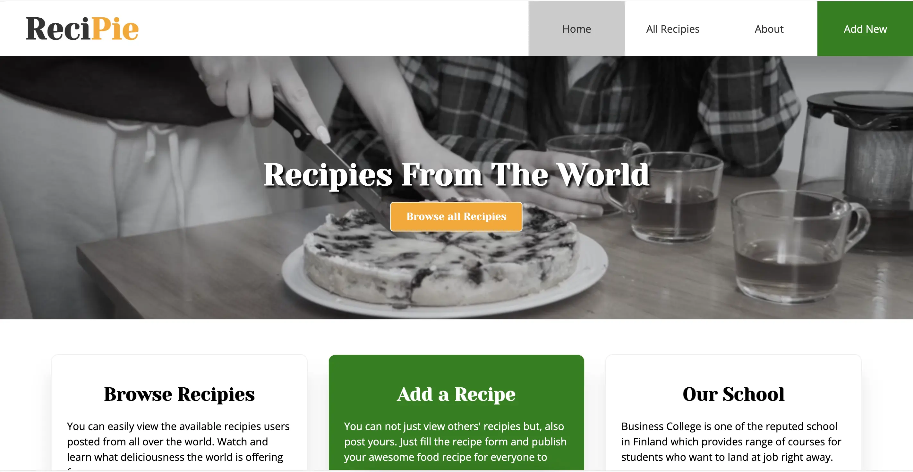
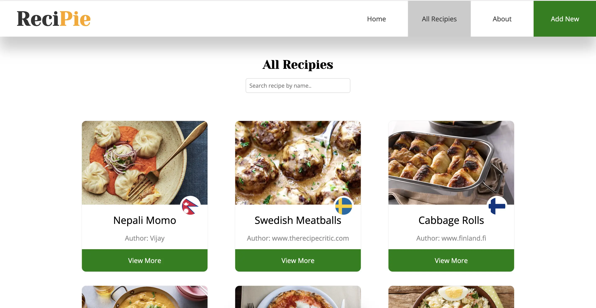
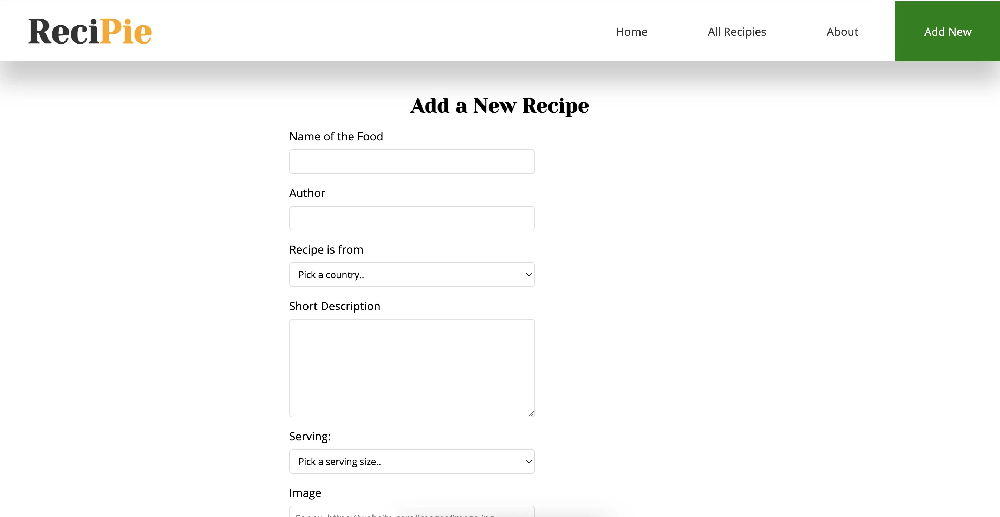

# ReciPie Website Created in React

## This website is a classroom project for Fullstack Web Developer Program at Business College Helsinki, 2022.

The purpose of this website is but not limited to learn basics of React including hooks, event handlers, conditional rendering, list and keys, React-router and GET and POST from/to local JSON Server.

User can input their country-specific food recipies and browse other recipies too.
User also can delete the post after 'providing the unique password generated at the moment of that specific recipe creation'.

### Tech Stack

1. HTML
1. React
1. CSS
1. JSON Server
1. RestCountries API

### Screenshots

#### 1.

 

#### 2.

 

#### 3.

 
